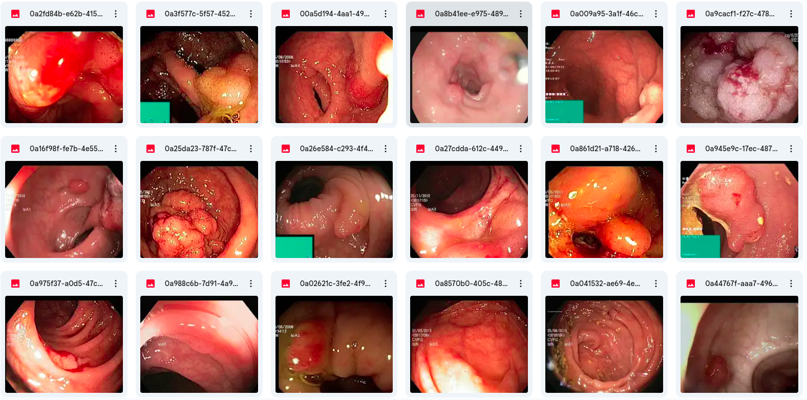
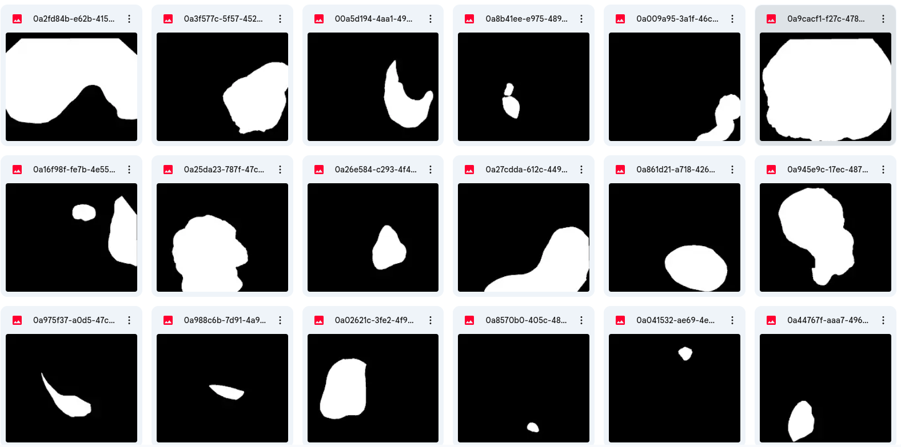
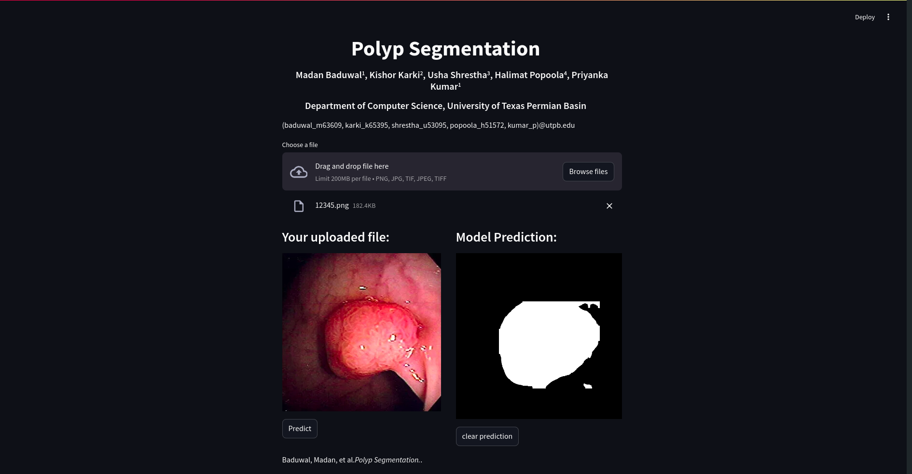

# Transformer-based Interpretable Polyp Segmentation

## Data 

You can get all polyp-segmentation data from [here](https://drive.google.com/drive/folders/1D4K7g9a_6VNufGHpjo4AIJ_SSlEsi_mg?usp=sharing).

Snapshot of data: 

<div style="display: flex; justify-content: space-around;">
  
  
</div>


## Training Model

You can follow notebook folder to train models.

## Inference

Install requirements using pip package.

```
pip install <package>
```

```
streamlit run app.py
```




## BibTeX

```
@article{baduwal2024,
  author    = {Madan Baduwal, Kishor Karki, Usha Shrestha, Halimat Popoola,},
  title     = {Transformer-based Interpretable Polyp Segmentation},
  journal   = {},
  year      = {},
}
```